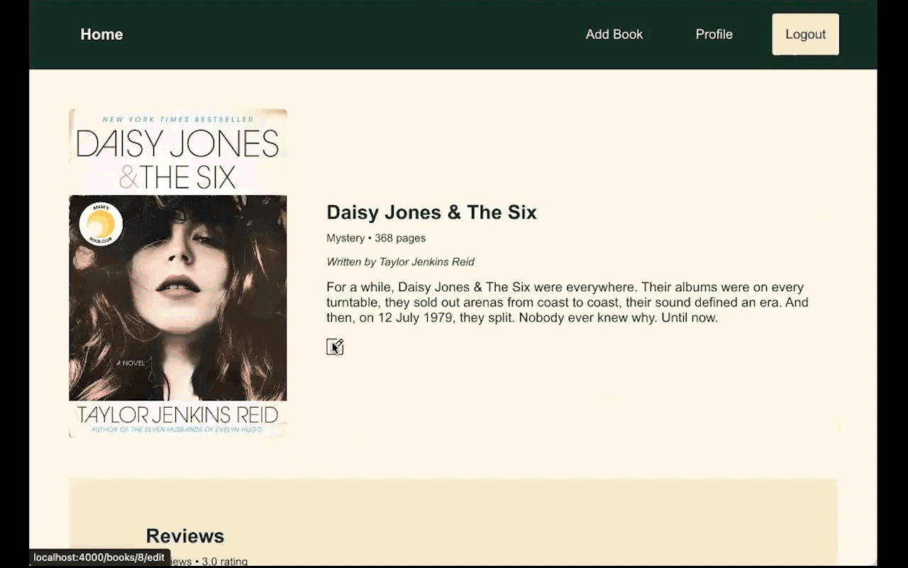

# BookClub

## Description

BookClub is a social networking site for book lovers. It serves as a virtual community where readers can connect with others, discover new books, track their reading progress, and engage in discussions about literature.

## Requirements

* Ruby 2.7.4
* NodeJS (v16) and npm
* Homebrew

## Setup

To run this application locally on your machine, follow these steps:

1. Fork and clone the repository to your local machine using Git:

```console
$ git clone git@github.com:your-username/phase-4-project.git
```


2. Navigate to the project directory:

```console
$ cd phase-4-project
```


3. Set up the frontend and backend dependencies from the root directory:

```console
$ npm install --prefix client
$ bundle install
$ rails db:migrate db:seed
```


4. Run the Rails application in one terminal:

```console
$ rails s
```


5. Then, **open another terminal** and run React:

```console
$ npm start --prefix client
```

## Demo
<p float="left">




</p>
<p float="left">


</p>


## MVP

As a user, I can:
  * Sign up for an account
  * Log in to the site & remain logged in
  * Log out
  * View a list of all books and their respective reviews
  * Create a review for one specific book
  * Modify or delete a review that I left
  * Create a new book
  * Modify or delete a book
  * View my top 5 rated books
  * View a list of all my reviews and their respective books
  * Search books based on their title
  * Filter books based on their average rating

## Resources

  * GoodReads: https://www.goodreads.com/
  * FontAwesome